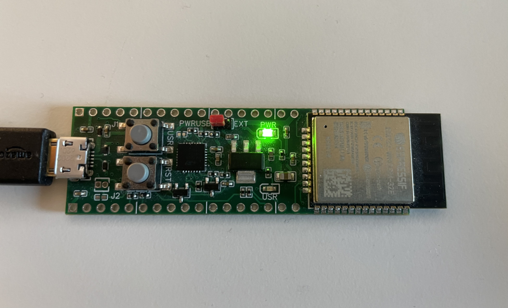

 

  

<h3 align="center">A custom ESP32 SOC</h3>

  

    Schematics and EasyEDA files for a custom form factor ESP32 SOC design.

<!-- ABOUT THE PROJECT -->
## About The Project

This design was produced following an excellent [tutorial video](https://youtu.be/S_p0YV-JlfU?feature=shared) by [Robert Feranec](https://www.youtube.com/@RobertFeranec). It's a slightly more rectangular design than the ESP32-devkit, having an extra user controllable LED, and a jumper to select external 5V source.

Ordering the minimum 5 pieces from JLCPCB was about $175, the BOM file is attached.

The board was doable with the standard [easyEDA](https://easyeda.com/) designer, either online or local version.

[![Product Name Screen Shot][product-screenshot]](Schematic_esp32_custom.pdf)

[![PCB screenshot][pcb-screenshot]](#readme-top)

(<a href="#readme-top">back to top</a>)

### Included files

* [EasyEDA export file](easyeda/SCH_esp32-custom_2024-02-02.json)
* [Bill of materials (CSV)](easyeda/BOM_PCB_Led%20driver_2024-02-02.csv)
* [Autorouter export](easyeda/Autorouter_PCB_esp32-custom_2024-02-02.dsn)
* [PCB Schematics](Schematic_esp32_custom.pdf)

(<a href="#readme-top">back to top</a>)

## Acknowledgments

* [How to Make Custom ESP32 Board in 3 Hours | Full Tutorial](https://youtu.be/S_p0YV-JlfU?feature=shared)
* [Espressif ESP32](https://www.espressif.com/en/products/socs/esp32)

(<a href="#readme-top">back to top</a>)

<!-- MARKDOWN LINKS & IMAGES -->
<!-- https://www.markdownguide.org/basic-syntax#reference-style-links -->
[pcb-screenshot]: images/PCB_PCB_esp32-custom.png
[product-screenshot]: images/Schematic_esp32_custom.png
